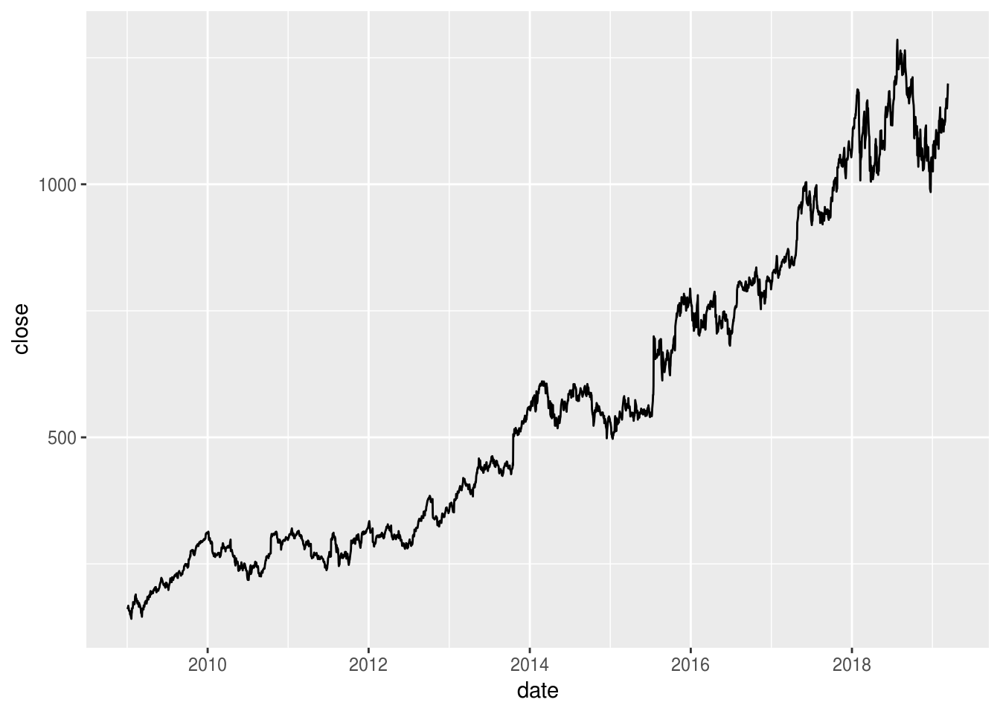
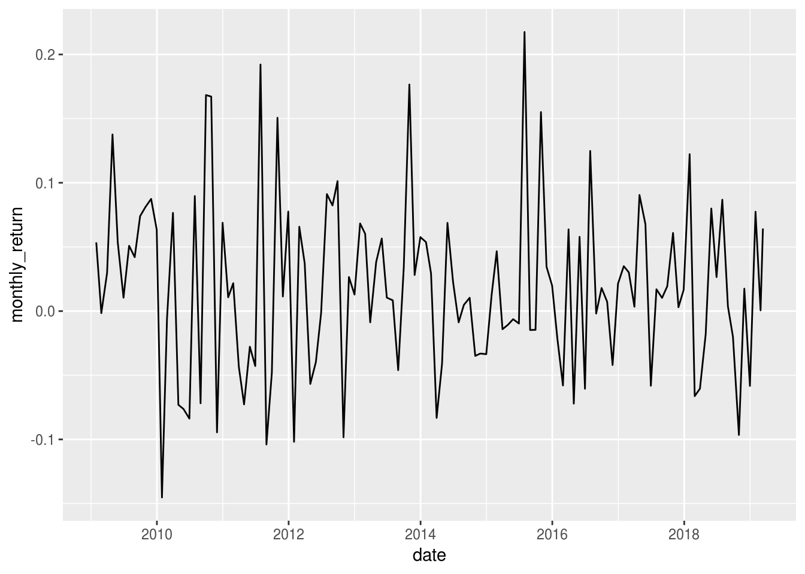
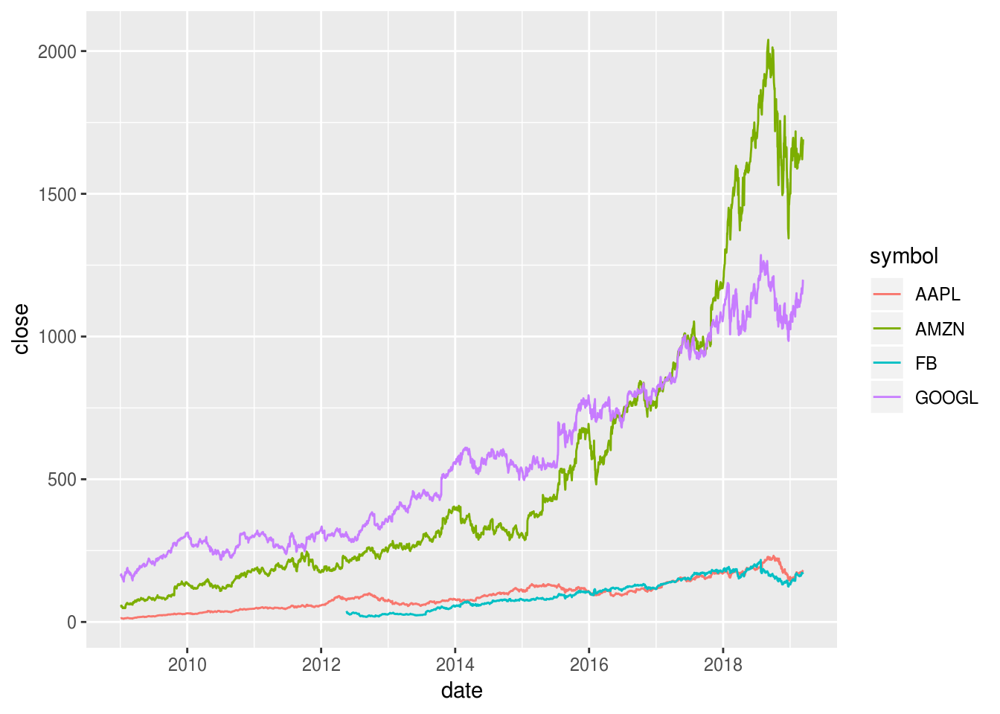
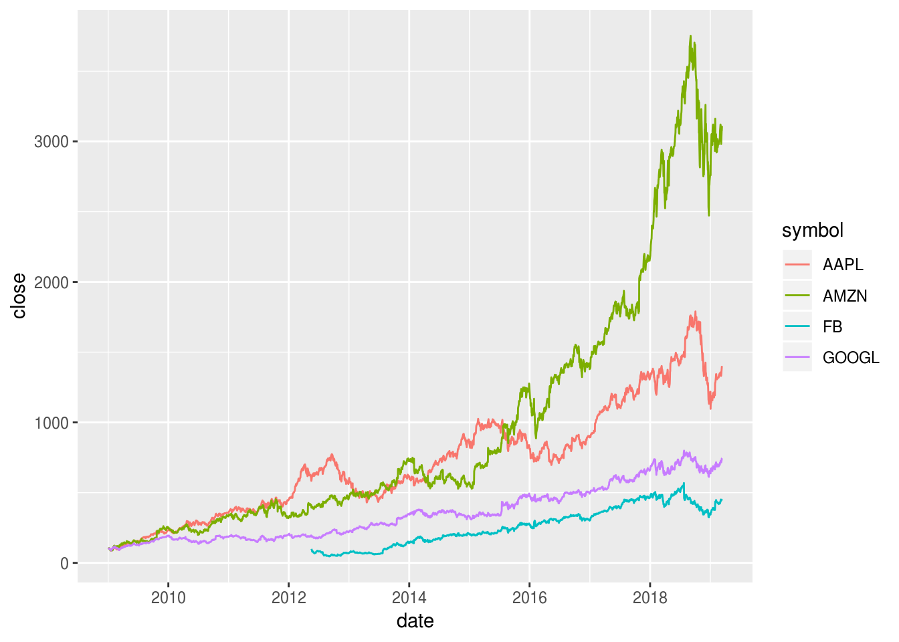

# Timeseries with tidyquant {#tidyquant}


*This chapter originated as a community contribution created by [	naotominakawa](https://github.com/naotominakawa){target="_blank"}*

*This page is a work in progress. We appreciate any input you may have. If you would like to help improve this page, consider [contributing to our repo](contribute.html).*


## Overview
This section covers how to use the `tidyquant` package to conduct timeseries analysis.

## What is tidyquant?

`tidyquant` is an one-stop shop for financial analysis. It is suitable for analyzing timeseries data, such as financial and economic data. `tidyquant` connects to various data sources such as Yahoo! Finance, Morning Star, Bloomberg market data, etc. It also behaves well with other `Tidyverse` packages.

## Installing tidyquant
To install `tidyquant`, you can run the following code:

```r
# install.packages("tidyquant")
library(tidyquant)
```

If you want to see which functions are available, you can run the following:

```r
# to see which functions are available
tq_transmute_fun_options()
```

```
## $zoo
##  [1] "rollapply"          "rollapplyr"         "rollmax"           
##  [4] "rollmax.default"    "rollmaxr"           "rollmean"          
##  [7] "rollmean.default"   "rollmeanr"          "rollmedian"        
## [10] "rollmedian.default" "rollmedianr"        "rollsum"           
## [13] "rollsum.default"    "rollsumr"          
## 
## $xts
##  [1] "apply.daily"     "apply.monthly"   "apply.quarterly"
##  [4] "apply.weekly"    "apply.yearly"    "diff.xts"       
##  [7] "lag.xts"         "period.apply"    "period.max"     
## [10] "period.min"      "period.prod"     "period.sum"     
## [13] "periodicity"     "to_period"       "to.daily"       
## [16] "to.hourly"       "to.minutes"      "to.minutes10"   
## [19] "to.minutes15"    "to.minutes3"     "to.minutes30"   
## [22] "to.minutes5"     "to.monthly"      "to.period"      
## [25] "to.quarterly"    "to.weekly"       "to.yearly"      
## 
## $quantmod
##  [1] "allReturns"      "annualReturn"    "ClCl"           
##  [4] "dailyReturn"     "Delt"            "HiCl"           
##  [7] "Lag"             "LoCl"            "LoHi"           
## [10] "monthlyReturn"   "Next"            "OpCl"           
## [13] "OpHi"            "OpLo"            "OpOp"           
## [16] "periodReturn"    "quarterlyReturn" "seriesAccel"    
## [19] "seriesDecel"     "seriesDecr"      "seriesHi"       
## [22] "seriesIncr"      "seriesLo"        "weeklyReturn"   
## [25] "yearlyReturn"   
## 
## $TTR
##  [1] "adjRatios"          "ADX"                "ALMA"              
##  [4] "aroon"              "ATR"                "BBands"            
##  [7] "CCI"                "chaikinAD"          "chaikinVolatility" 
## [10] "CLV"                "CMF"                "CMO"               
## [13] "DEMA"               "DonchianChannel"    "DPO"               
## [16] "DVI"                "EMA"                "EMV"               
## [19] "EVWMA"              "GMMA"               "growth"            
## [22] "HMA"                "KST"                "lags"              
## [25] "MACD"               "MFI"                "momentum"          
## [28] "OBV"                "PBands"             "ROC"               
## [31] "rollSFM"            "RSI"                "runCor"            
## [34] "runCov"             "runMAD"             "runMax"            
## [37] "runMean"            "runMedian"          "runMin"            
## [40] "runPercentRank"     "runSD"              "runSum"            
## [43] "runVar"             "SAR"                "SMA"               
## [46] "SMI"                "SNR"                "stoch"             
## [49] "TDI"                "TRIX"               "ultimateOscillator"
## [52] "VHF"                "VMA"                "volatility"        
## [55] "VWAP"               "VWMA"               "wilderSum"         
## [58] "williamsAD"         "WMA"                "WPR"               
## [61] "ZigZag"             "ZLEMA"             
## 
## $PerformanceAnalytics
## [1] "Return.annualized"        "Return.annualized.excess"
## [3] "Return.clean"             "Return.cumulative"       
## [5] "Return.excess"            "Return.Geltner"          
## [7] "zerofill"
```

## Single timeseries
Obtain historical data for single stock (for example, Google):

```r
# get historical data for single stock. e.g. google
tq_get("GOOGL", get="stock.prices")
```

```
## # A tibble: 2,759 x 7
##    date        open  high   low close   volume adjusted
##    <date>     <dbl> <dbl> <dbl> <dbl>    <dbl>    <dbl>
##  1 2008-01-02  347.  349.  339.  343.  8605100     343.
##  2 2008-01-03  343.  344.  339.  343.  6498400     343.
##  3 2008-01-04  340.  341.  328.  329. 10708800     329.
##  4 2008-01-07  327.  331.  319.  325. 12793900     325.
##  5 2008-01-08  327.  330.  316.  316. 10667500     316.
##  6 2008-01-09  315.  327.  312.  327. 13465900     327.
##  7 2008-01-10  323.  329.  320.  324. 12655700     324.
##  8 2008-01-11  322.  325.  315.  319.  9944000     319.
##  9 2008-01-14  326.  329.  323.  327.  8886100     327.
## 10 2008-01-15  323.  325.  318.  319. 11125200     319.
## # ... with 2,749 more rows
```

Calculate monthly return of single stock:

```r
# calculate monthly return of single stock
tq_get(c("GOOGL"), get="stock.prices") %>%
  tq_transmute(select=adjusted,
               mutate_fun=periodReturn,
               period="monthly",
               col_rename = "monthly_return")
```

```
## # A tibble: 132 x 2
##    date       monthly_return
##    <date>              <dbl>
##  1 2008-01-31        -0.176 
##  2 2008-02-29        -0.165 
##  3 2008-03-31        -0.0652
##  4 2008-04-30         0.304 
##  5 2008-05-30         0.0200
##  6 2008-06-30        -0.101 
##  7 2008-07-31        -0.100 
##  8 2008-08-29        -0.0221
##  9 2008-09-30        -0.135 
## 10 2008-10-31        -0.103 
## # ... with 122 more rows
```

Create a line chart of the *closing price* for single stock:

```r
# showing closing price for single stock
tq_get(c("GOOGL"), get="stock.prices") %>%
  ggplot(aes(date, close)) +
  geom_line()
```



Create a line chart of the *monthly return* for single stock:

```r
# showing monthly return for single stock
tq_get(c("GOOGL"), get="stock.prices") %>%
  tq_transmute(select=adjusted,
               mutate_fun=periodReturn,
               period="monthly",
               col_rename = "monthly_return") %>%
  ggplot(aes(date, monthly_return)) +
  geom_line()
```



## Multiple timeseries
Obtain historical data for multiple stocks (for example, GAFA):

```r
# get historical data for multiple stocks. e.g. GAFA
tq_get(c("GOOGL","AMZN","FB","AAPL"), get="stock.prices")
```

```
## # A tibble: 9,932 x 8
##    symbol date        open  high   low close   volume adjusted
##    <chr>  <date>     <dbl> <dbl> <dbl> <dbl>    <dbl>    <dbl>
##  1 GOOGL  2008-01-02  347.  349.  339.  343.  8605100     343.
##  2 GOOGL  2008-01-03  343.  344.  339.  343.  6498400     343.
##  3 GOOGL  2008-01-04  340.  341.  328.  329. 10708800     329.
##  4 GOOGL  2008-01-07  327.  331.  319.  325. 12793900     325.
##  5 GOOGL  2008-01-08  327.  330.  316.  316. 10667500     316.
##  6 GOOGL  2008-01-09  315.  327.  312.  327. 13465900     327.
##  7 GOOGL  2008-01-10  323.  329.  320.  324. 12655700     324.
##  8 GOOGL  2008-01-11  322.  325.  315.  319.  9944000     319.
##  9 GOOGL  2008-01-14  326.  329.  323.  327.  8886100     327.
## 10 GOOGL  2008-01-15  323.  325.  318.  319. 11125200     319.
## # ... with 9,922 more rows
```

Create a multiple line chart of the closing prices of multiple stocks (again, GAFA). We can show each stock in a different color on the same graph:

```r
# Create a multiple line chart of the closing prices of the four stocks,
# showing each stock in a different color on the same graph.
tq_get(c("GOOGL","AMZN","FB","AAPL"), get="stock.prices") %>%
  ggplot(aes(date, close, color=symbol)) +
  geom_line()
```



Transform the data so each stock begins at 100 and replot (Standardize the data so that we can compare timeseries):

```r
# Create a multiple line chart of the closing prices of the four stocks,
# showing each stock in a different color on the same graph.
# Transform the data so each stock begins at 100 and replot.
tq_get(c("GOOGL","AMZN","FB","AAPL"), get="stock.prices") %>%
  group_by(symbol) %>%
  mutate(close = 100*close/first(close)) %>%
  ggplot(aes(date, close, color=symbol)) +
  geom_line()
```



Calculate *monthly return* of multiple stocks (again, GAFA):

```r
# calculate monthly return of multiple stocks
tq_get(c("GOOGL","AMZN","FB","AAPL"), get="stock.prices") %>%
  group_by(symbol) %>%
  tq_transmute(select=adjusted,
               mutate_fun=periodReturn,
               period="monthly",
               col_rename = "monthly_return")
```

```
## # A tibble: 476 x 3
## # Groups:   symbol [4]
##    symbol date       monthly_return
##    <chr>  <date>              <dbl>
##  1 GOOGL  2008-01-31        -0.176 
##  2 GOOGL  2008-02-29        -0.165 
##  3 GOOGL  2008-03-31        -0.0652
##  4 GOOGL  2008-04-30         0.304 
##  5 GOOGL  2008-05-30         0.0200
##  6 GOOGL  2008-06-30        -0.101 
##  7 GOOGL  2008-07-31        -0.100 
##  8 GOOGL  2008-08-29        -0.0221
##  9 GOOGL  2008-09-30        -0.135 
## 10 GOOGL  2008-10-31        -0.103 
## # ... with 466 more rows
```

Create a multiple line chart of monthly return of the four stocks. Again, we can show each stock in a different color on the same graph:

```r
# Create a multiple line chart of monthly return of the four stocks,
# showing each stock in a different color on the same graph
tq_get(c("GOOGL","AMZN","FB","AAPL"), get="stock.prices") %>%
  group_by(symbol) %>%
  tq_transmute(select=adjusted,
               mutate_fun=periodReturn,
               period="monthly",
               col_rename = "monthly_return") %>%
  ggplot(aes(date, monthly_return, color=symbol)) +
  geom_line()
```


## External Resources
- [tidyquant CRAN doc](https://cran.r-project.org/web/packages/tidyquant/vignettes/TQ00-introduction-to-tidyquant.html){target="_blank"}: formal documentation on the package
- [tidyquant Github repo](https://github.com/business-science/tidyquant){target="_blank"}: Github repository for the `tidyquant` package with a great README
